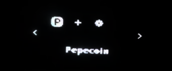
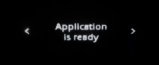
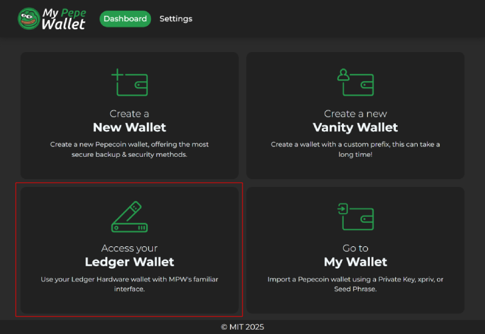
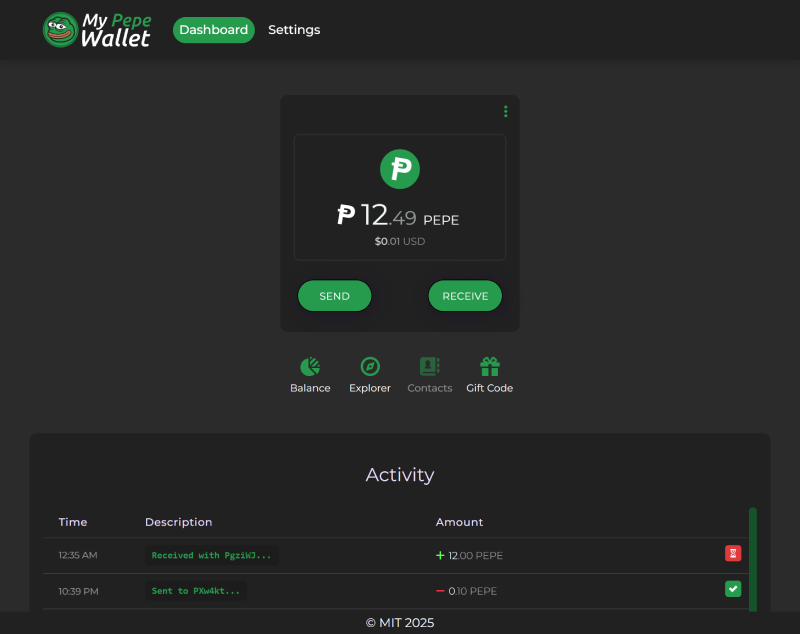
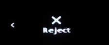
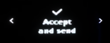

# Connect ***Ledger Nano S Plus*** to ***My Pepe Wallet***

A Ledger Device is a hardware wallet that is considered one of the most secure ways to store your digital assets. Ledger uses an offline, or cold storage, method of generating private keys, making it a preferred method for many crypto users.

This guide will help you to connect your *Ledger Nano S Plus* to the [*My Pepe Wallet*](https://wallet.pepeblocks.com) web wallet. The *My Pepe Wallet* web wallet enables you to Send and Receive *PEP*.  

The Pepecoin app is developed and supported by the [Pepecoin.org](https://pepecoin.org) team.

## Support

Website: https://pepecoin.org  
Discord: https://pepecoin.org/discord  
Telegram: https://t.me/PepecoinGroup  
Reddit: https://reddit.com/r/pepecoin  

---

### 1. Before you start

- You've [initialized](https://support.ledger.com/article/360000613793-zd) your *Ledger Nano S Plus*.  
- The latest firmware is [installed](https://support.ledger.com/article/360013349800-zd).  
- Ledger Live is [ready to use](https://support.ledger.com/article/4404389503889-zd).  

---

### 2. Install the Pepecoin app

- Open the Manager in Ledger Live.  
- Connect and unlock your *Ledger Nano S Plus*.  
- If asked, allow the manager on your device by pressing the right button.  
- Find **Pepecoin** in the app catalog.
- Press the **Install** button of the app.
   - An installation window appears.
   - Your device will display **Processing…**
   - The app installation is confirmed.
    
      

---

### **3. Connect *Ledger Nano S Plus* to your Pepecoin wallet**

- Open the Pepecoin application on your *Ledger Nano S Plus*, the screen will display "Application is ready".

      

- Launch the ***My Pepe Wallet*** web wallet by visiting https://wallet.pepeblocks.com.
- Choose "Access your Ledger Wallet".

    

- You can now view your Pepecoin wallet balance and history.  

    

---

### ⚠️ Important: Approving or Rejecting on your Ledger

For most actions, your *Ledger Nano S Plus* will ask you to **confirm the details**.  

- If the information displayed on your *Ledger Nano S Plus* matches what you expect, select **Approve** or **Accept**.  
- If it does not match, select **Reject**.  
- Press both buttons to confirm your choice.  

  
  

---

### 4. Get an address using ***My Pepe Wallet***

- Press **Receive** to get an address.  
- Confirm that the address displayed on the website matches the address displayed on your *Ledger Nano S Plus*.  
  - If it matches, select **Approve**. You can use the address to receive Pepecoin. 
  - If it doesn’t, select **Reject**.  
- Press both buttons to confirm.

---

### 5. Send Pepecoin using ***Ledger Nano S Plus*** and ***My Pepe Wallet***

> ⚠️ **Safety reminder:** Always double-check both the recipient and change addresses, as well as the amount and fees. Reject any transaction that looks suspicious or doesn’t match the expected details.

- Press **Send** in *My Pepe Wallet*.
- Enter the **Receiving address** and the **Amount** of Pepecoin to send.
- Press **Send** to confirm.
- Verify the **change address**:  
   - Check that the change address displayed on the website matches the change address on your *Ledger Nano S Plus*.
        - If it matches, select **Approve**.
        - If it doesn’t, select **Reject**.
   - Remember this address, it will be shown again in Review Output #2.  

- Confirm transaction details on your *Ledger Nano S Plus*, screen by screen:  
   - **Review Output #1:** Shows the recipient address and amount.  
     - If correct, select **Accept**.  
     - If incorrect, select **Reject**.  
   - **Review Output #2:** Shows the change address and amount.  
     - Verify it matches the change address shown previously.  
     - Select **Accept** if correct, or **Reject** if it doesn’t match.  
   - **Confirm Transaction:** Shows transaction fees.
     - Verify that the transaction fee is acceptable.
     - Select **Accept and send** to sign and broadcast the transaction.  
      
     - Select **Reject** to cancel the transaction.  
      

### **6. Contact info**

- Website: https://pepecoin.org/
- Support:
  - Join the `#help` channel in our Discord: https://pepecoin.org/discord
  - Telegram: https://t.me/PepecoinGroup
  - Reddit: https://reddit.com/r/pepecoin  
